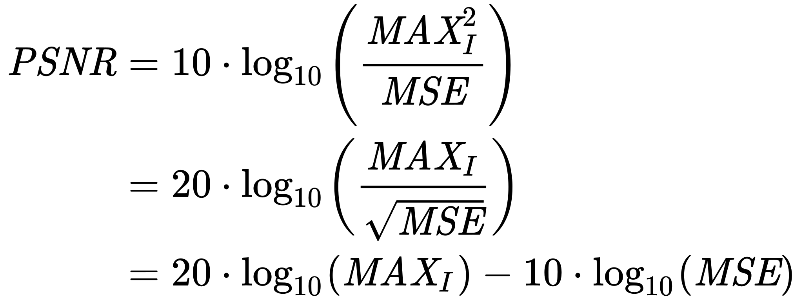
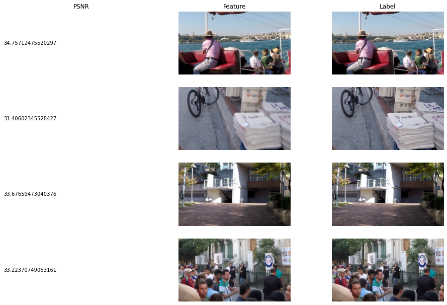

# Machine Learning Engineer Nanodegree
## Capstone Project
Emile Papillon  
June 1st, 2021

## I. Definition

### Project Overview

One aspect of machine learning that I find fascinating is that contrary to most algorithms, ML algorithms are able to add missing information to some input. For example, when we use a classifier on an image we are adding a label, which provides additional information. A less common area where we can apply this principle is the reconstruction of deteriorated signals. In signal processing theory, the signal-to-noise ratio defines how much information can be retrieved from a given signal. By learning some patterns in signals, ML models are able to improve the SNR.

Typically, when information is lost it can no longer be recovered. ML algorithms can achieve signal recovery by learning patterns in certain signals. In this Capstone project I want to apply this to degraded images like blurred photographs. Improving the quality of degraded images has a wide spectrum of applications like recovery of lower quality images transmitted over the network in-situ on ultra high definition monitors equipped with computing devices capable of performing the recovery, or improving the quality of images taken by security systems.

We propose to use a state-of-the-art model (MPRNet) to remove blur from photographs.. If time allows, the same approach can be used to remove noise from the same images as well.

The MPRNet model is currently (as of June 2021) in second rank [on the PSNR scale with the GoPro dataset.](https://paperswithcode.com/sota/deblurring-on-gopro?p=multi-stage-progressive-image-restoration) It mixes encoder-decoder architectures - to learn the contextualized features - with high resolution branches which retains local information. It is a complex model which we will reproduce here. The [original model](https://github.com/swz30/MPRNet) can be found on GitHub. 

### Problem Statement

As photographers, sometimes we get disappointed when we view our photos or video footage on a large screen. An image that we were convinced was crisp isn't so sharp when enlarged. To solve this, some people are using machine learning to recreate the image to add back the information lost by the blurr. There are applications available to correct photos using machine learning but since these applications were launched, significant progress has been made in the field of image restoration. 

Blurry photographs can be improved using machine learning. The problem to be solved is deblurring blurry images. The MPRNet model is the second best model as of now to solve this problem, so we will leverage the design in this project. 

### Metrics
The Peak Signal to Noise Ratio (PSNR) is the metric used to define how much blur was removed from an image. 

Peak signal to noise ratio is used to quantify the amount of blur in the images by comparing them to a "perfect" image (one without blur). In the following image (generated from our jupyter notebook), we look at the training data's PSNR, that is the peak signal to noise ratio between the trainin set's features and labels.

PSNR (dB) Can be obtained by the following calculation:

Where: 
MAX_I is the largest value of the pixels, here 255, and MSE is the mean squared error between the perfect image, and the blurry one. 
According to Wikipedia "Peak signal-to-noise ratio (PSNR) is an engineering term for the ratio between the maximum possible power of a signal and the power of corrupting noise". As we can see from the calculation, the larger the corrupting noise, the larger  the MSE, and the lower the PSNR (and vice-versa).

In other words, the PSNR can be seen as the noise in the blurry image as compared to the sharp one (in decibels).

## II. Analysis

### Data Exploration

To train the model, the GoPro dataset for deblurring is used. The data contains 2103 training pairs (clean - blurr) with a size of 1,280×720px and 1111 images for validation of the same size. The dataset consists of pairs of a realistic blurry image and the corresponding ground truth sharp images that are obtained by a high-speed camera. The dataset is [publicly available](https://seungjunnah.github.io/Datasets/gopro).

We also provide our own image for testing the model. The image was taken with a DSLR and is purposedly blurry. The PSNR will be calculated on this image. 

To illustrate the dataset used for training and validation, in the next section is a sample of 4 images taken from the training datase (we are showing the blurry and sharp images for 4 data points) as well as the PSNR for each point.

### Exploratory Visualization

The following illustrates a sample of our training dataset. Images on the left are blurry and images on the right are sharp. The PSNR (in dB) in the left columns quantifies the amount of blur in the blurry images. 

### Algorithms and Techniques

There is no preprocessing done with the images except format changes between numpy arrays and tensors. Hence, in this section we will give a few words about the model and the number of parameters.

The model used was the MPRNet described in great details [in this article](https://arxiv.org/pdf/2102.02808.pdf). The reader is advised to consult the work done developing the MPRNet to gain further familiarity with the model. The element that most differentiates this model is the multi-stage approach to noise reduction. The majority of image restoration methods use single stage. 

Here is a performance comparison taken from the publication cited abov.
Times are for running on the Nvidia Titan Xp GPU.

| Method        | DeblurGAN-v2  | SRN   | DMPHN | Suin | MPRNet (Ours) |
| ------------- | ------------- | ----- | ----- | ---- | ------------- |
|  PSNR (dB)    | 29.55         | 30.10 | 31.20 | 31.85| 32.66         | 
| Million Params| 60.9          |   6.8 | 21.7  | 23.0 | 20.1          |
| Time (S)      | 0.21          |  0.57 | 1.07  | 0.34 | 0.18          |

From this table, we see that MPRNet is a good choice of model for deblurring since it is lightweight, fast and achieves the best results.

### Benchmark
The paper mentioned above illustrates various benchmarks and compares the results obtained with the model on benchmark models. We have created our own image and tested the model on that image to see if we achieved simliar PSNR. Here are two images. The left one is a blurred image and the right one is on on which we have run the model described here. We can notice by looking carefully at the image on the right that it was improved compared to the image on the left. 

We calculated the PSNR of these two images and we note a drastic improvement of 41 dB. This means that blur was greatly remnovede from the image and that we are happy with the results.

## III. Methodology

### Data Preprocessing
In this work, we propose a multi-stage architecture for
image restoration that progressively improves degraded inputs by injecting supervision at each stage. We develop
guiding principles for our design that demand complementary feature processing in multiple stages and a flexible information exchange between them. To this end, we propose
contextually-enriched and spatially accurate stages that encode a diverse set of features in unison. To ensure synergy
between reciprocal stages, we propose feature fusion across
stages and an attention guided output exchange from earlier stages to the later ones. Our model achieves significant
performance gains on numerous benchmark datasets. In addition, our model is light-weighted in te

### Implementation
De prohibitively high. As such, it is of great interest to develop resource-efficient image restoration models. One solution is to train the same network by adjusting its capacity every time the target system is changed. However, it
is tedious and oftentimes infeasible. A more desirable approach is to have a single network that can make (a) early
predictions for compute efficient systems and (b) latter predictions to obtain high accuracy. A multi-stage restoration
model naturally offers such functionalities.
Table 7 reports the stage-wise results of our multi-stage
approach. Our MPRNet demonstrates competitive restoration performance at each stage. Notably, our stage-1 model
is light, fast, and yields better results th

### Refinement
We report the performance of evaluated image deblurring approaches on the synthetic GoPro [53] and HIDE [69]
datasets in Table 3. Overall, our model performs favorably
against other algorithms. Compared to the previous best
performing technique [70], our method achieves 9% improvement in PSNR and 21% in SSIM on the GoPro [53]
dataset, and a 11% and 13% reduction in error on the HIDE
dataset [69]. It is worth noticing that our network is trained
only on the GoPro dataset, but achieves the state-of-the-art
results (+0.98 dB) on the HIDE dataset, thereby demonstrating its strong generalization capability.
We evaluate our MPRNet on the real-world images of
a recent RealBlur [64] dataset under two experimental settings: 1). apply the GoPro trained model directly on RealBlur (to test generalization to real images), and 2). train
and test on RealBlur data. Table 4 shows the experimental results. For setting 1, our MPRNet obtains performance
gains of 0.29 dB on the RealBlur-R subset and 0.28 dB
on the RealBlur-J subset over the DMPHN algorithm [88].
A similar trend is observed for setting 2, where our gains
over SRN [71] are 0.66 dB and 0.38 dB on RealBlur-R and
RealBlur-J, respectively.
Figure 6 shows some deblurred images by the evaluated
approaches. Overall, the images restored by our model are
sharper and closer to the ground-truth than those by others.We report the performance of evaluated image deblurring approaches on the synthetic GoPro [53] and HIDE [69]
datasets in Table 3. Overall, our model performs favorably
against other algorithms. Compared to the previous best
performing technique [70], our method achieves 9% improvement in PSNR and 21% in SSIM on the GoPro [53]
dataset, and a 11% and 13% reduction in error on the HIDE
dataset [69]. It is worth noticing that our network is trained
only on the GoPro dataset, but achieves the state-of-the-art
results (+0.98 dB) on the HIDE dataset, thereby demonstrating its strong generalization capability.
We evaluate our MPRNet on the real-world images of
a recent RealBlur [64] dataset under two experimental settings: 1). apply the GoPro trained model directly on RealBlur (to test generalization to real images), and 2). train
and test on RealBlur data. Table 4 shows the experimental results. For setting 1, our MPRNet obtains performance
gains of 0.29 dB on the RealBlur-R subset and 0.28 dB
on the RealBlur-J subset over the DMPHN algorithm [88].
A similar trend is observed for setting 2, where our gains
over SRN [71] are 0.66 dB and 0.38 dB on RealBlur-R and
RealBlur-J, respectively.
Figure 6 shows some deblurred images by the evaluated
approaches. Overall, the images restored by our model are
sharper and closer to the ground-truth than those by others.

## IV. Results

### Model Evaluation and Validation
Datasets in Table 3. Overall, our model performs favorably
against other algorithms. Compared to the previous best
performing technique [70], our method achieves 9% improvement in PSNR and 21% in SSIM on the GoPro [53]
dataset, and a 11% and 13% reduction in error on the HIDE
dataset [69]. It is worth noticing that our network is trained
only on the GoPro dataset, but achieves the state-of-the-art
results (+0.98 dB) on the HIDE dataset, thereby demonstrating its strong generalization capability.
We evaluate our MPRNet on the real-world images of
a recent RealBlur [64] dataset under two experimental settings: 1). apply the GoPro trained model directly on RealBlur (to test generalization to real images), and 2). train
and test on RealBlur data. Table 4 shows the experimental results. For setting 1, our MPRNet obtains performance
gains of 0.29 dB on the RealBlur-R subset and 0.28 dB
on the RealBlur-J subset over the DMPHN algorithm [88].
A similar trend is observed for setting 2, where our gains
over SRN [71] are 0.66 dB and 0.38 dB on RealBlur-R and
RealBlur-J, respectively.
Figure 6 shows some deblurred images by the evaluated
approaches. Overall, the images restored by our model are
sharper and closer to the ground-truth than those by others.

### Justification
In this section, your model’s final solution and its results should be compared to the benchmark you established earlier in the project using some type of statistical analysis. You should also justify whether these results and the solution are significant enough to have solved the problem posed in the project. Questions to ask yourself when writing this section:
- _Are the final results found stronger than the benchmark result reported earlier?_
- _Have you thoroughly analyzed and discussed the final solution?_
- _Is the final solution significant enough to have solved the problem?_

## V. Conclusion

### Free-Form Visualization

### Reflection
We report the performance of evaluated image deblurring approaches on the synthetic GoPro [53] and HIDE [69]
datasets in Table 3. Overall, our model performs favorably
against other algorithms. Compared to the previous best
performing technique [70], our method achieves 9% improvement in PSNR and 21% in SSIM on the GoPro [53]
dataset, and a 11% and 13% reduction in error on the HIDE
dataset [69]. It is worth noticing that our network is trained
only on the GoPro dataset, but achieves the state-of-the-art
results (+0.98 dB) on the HIDE dataset, thereby demonstrating its strong generalization capability.
We evaluate our MPRNet on the real-world images of
a recent RealBlur [64] dataset under two experimental settings: 1). apply the GoPro trained model directly on RealBlur (to test generalization to real images), and 2). train
and test on RealBlur data. Table 4 shows the experimental results. For setting 1, our MPRNet obtains performance
gains of 0.29 dB on the RealBlur-R subset and 0.28 dB
on the RealBlur-J subset over the DMPHN algorithm [88].
A similar trend is observed for setting 2, where our gains
over SRN [71] are 0.66 dB and 0.38 dB on RealBlur-R and
RealBlur-J, respectively.
Figure 6 shows some deblurred images by the evaluated
approaches. Overall, the images restored by our model are
sharper and closer to the ground-truth than those by others.for the problem, and should it be used in a general setting to solve these types of problems?_

### Improvement
We report the performance of evaluated image deblurring approaches on the synthetic GoPro [53] and HIDE [69]
datasets in Table 3. Overall, our model performs favorably
against other algorithms. Compared to the previous best
performing technique [70], our method achieves 9% improvement in PSNR and 21% in SSIM on the GoPro [53]
dataset, and a 11% and 13% reduction in error on the HIDE
dataset [69]. It is worth noticing that our network is trained
only on the GoPro dataset, but achieves the state-of-the-art
results (+0.98 dB) on the HIDE dataset, thereby demonstrating its strong generalization capability.
We evaluate our MPRNet on the real-world images of
a recent RealBlur [64] dataset under two experimental settings: 1). apply the GoPro trained model directly on RealBlur (to test generalization to real images), and 2). train
and test on RealBlur data. Table 4 shows the experimental results. For setting 1, our MPRNet obtains performance
gains of 0.29 dB on the RealBlur-R subset and 0.28 dB
on the RealBlur-J subset over the DMPHN algorithm [88].
A similar trend is observed for setting 2, where our gains
over SRN [71] are 0.66 dB and 0.38 dB on RealBlur-R and
RealBlur-J, respectively.
Figure 6 shows some deblurred images by the evaluated
approaches. Overall, the images restored by our model are
sharper and closer to the ground-truth than those by others.
